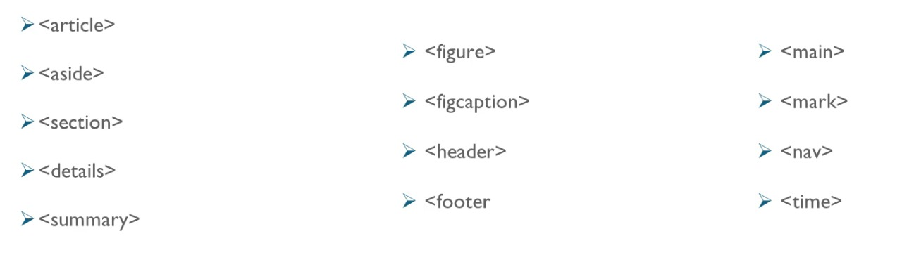

```html
Naan Mudhalvan Free Course: App Development

Curriculum:

Intro to HTML and HTML Tags
Minutes:
    
    Importance of HTML: 
        Supported by all browsers, Can do many customizations.
    
    Introduction to HTML: 
        Hyper Text Markup Language
        Several webpages constitute a website
        Doctype html? To render all HTML Elements properly.
        Head contains the meta information about the document.
    
    HTML basic Tags: 
        <p></p>,
        <!DOCTYPE html>, 
        <html lang = "en">,
        <head></head>,
         <title></title>,
         <link>,
        <body></body>
    
    HTML Text tags: 
        <p></p>,
        <h1>, <h2>, <h3>, <h4>, <h5>, <h6>,
        <div>,
        <span>,
        <address></address>,
        General note on the following tags: <dl>, <dt>, <dd>, <s>, <dfn>,
        <blockquote></blockquote>
    
    Semantic Elements in HTML5:
        They are self explanatory. Example: <form>, <table>, <header>, <footer>
        Semantic elements: 
```

```html
        <article></article>,
        <Aside></Aside>,
        Generic note on <section></section>,
        Hands on for <details></details> and <summary></summary> tags
        <figure></figure>, <figcaption></figcaption>
        <header></header>, <footer></footer>
HTML Links, Images and Frames
Minutes:
    

Lists and Tables
Minutes:
    

Forms and Form Elements
Minutes:
    

HTML Input Types
Minutes:
    

CSS Selectors, Colors, Background and Border
Minutes:
    

CSS Attribute Selectors
Minutes:
    

CSS Texts and Fonts
Minutes:
    

Gradient and Shadows
Minutes:
    

CSS Effects and Animations
Minutes:
    

Javascript Basics
Minutes:
    

Functions and Internal Memory Management
Minutes:
    

Object and Event Handling
Minutes:
    

Libraries and Frameworks
Minutes:
    

Regular Expressions (RegEx) in JavaScript
Minutes:

```
</span>